https://github.com/lukasznowarkiewicz/Emersense/assets/82212257/11a2cc54-8b61-4021-b137-e5024b813931
# Emersense - Emergency Vehicle Detection System

## Introduction

Emersense is an innovative project developed by a group of dedicated students from Poznan University of Technology. Initiated during the challenging times of the pandemic, this project was brought to life entirely remotely by a team of four members located in four different cities across Poland. The project was realized as part of a competition organized by Enactus Poland, within the framework of the Enactus student organization, which promotes socially responsible projects.

The primary issue that Emersense aims to address is the often too-late response to an approaching emergency vehicle. This problem poses a significant risk not only to the efficiency of emergency services but also to the safety of both the emergency responders and the general public. By leveraging advanced technology, Emersense seeks to provide a timely warning about approaching emergency vehicles, thereby improving response times and reducing the potential for accidents.

## Solution Overview

The core of the Emersense project is a device that uses microphone data to detect emergency vehicle sirens amidst urban noise. It distinguishes these sirens from other sounds such as street noise and engine sounds, and informs the driver of their presence.

- **Siren Detection:** Utilizes signal processing to identify emergency vehicle sirens.
- **Driver Alert:** Notifies the driver through auditory and visual signals.

## Initial Trials on a PC

At the start, we gathered lots of different siren sounds from the internet to build a sound database for Emersense. We quickly found out there's a huge variety of siren sounds. These sounds not only change from one emergency vehicle to another but also differ a lot between countries. There wasn’t even a standard for sirens within the EU. Despite these challenges, we began with the easiest siren sounds to recognize: the sweep and two-tone sirens.

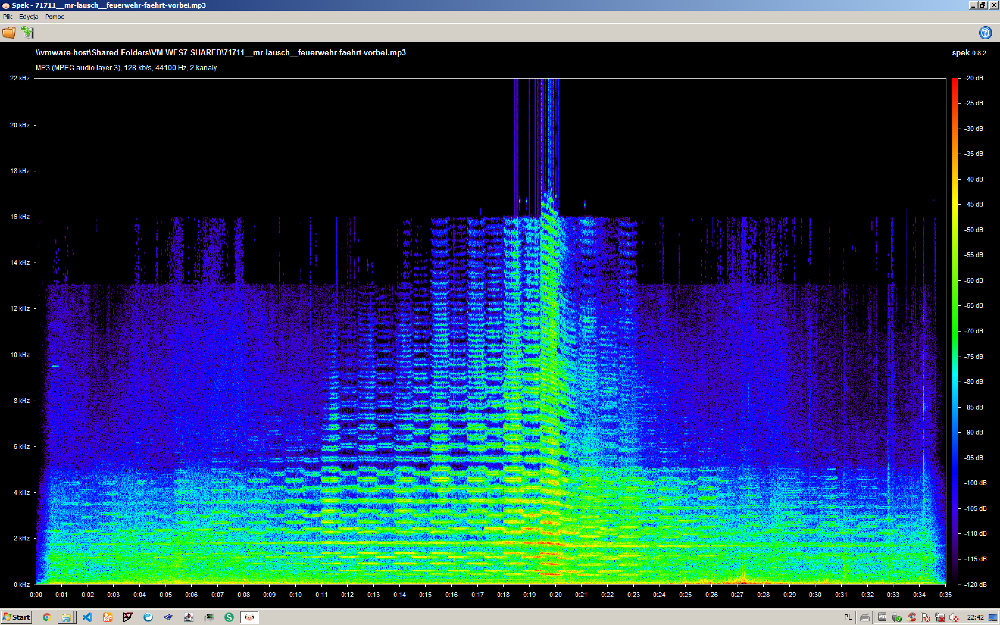

Our first try at figuring out the siren sounds used the FFT (Fast Fourier Transform) library on a computer with an 8-core Intel Core i7 processor. But, we soon realized it was too complex to process the sounds in real time on this setup. So, we switched to the DFT (Discrete Fourier Transform), which was faster and allowed us to make our first successful programs that could recognize two-tone sirens.

Knowing we couldn’t use Python code directly on a microcontroller for the final product, we started to look into low-power hardware that could work for the Emersense device. This was a big step because it helped us focus on finding a solution that could actually be built into a real, working device.

## Trials on the DevKit

After our initial success, we started writing similar code in C for the ESP32 microcontroller. Our first goal was to get a correct spectrum of the signal received from the microphone. 

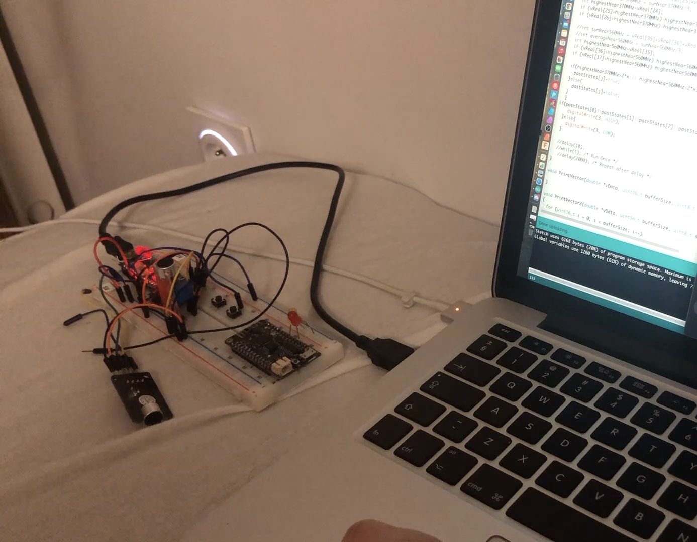

We soon realized that an electret microphone with an operational amplifier connected to an analog input was giving very inconsistent results. After trying out three more microphone modules, which all produced similarly poor outcomes, we switched to a MEMS microphone that uses the I2S bus - the INMP441. 

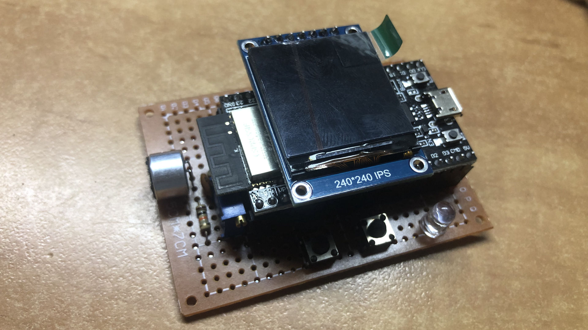

Eventually, we managed to get preliminarily satisfying results and programmed it to recognize one type of two-tone siren.

https://github.com/lukasznowarkiewicz/Emersense/assets/82212257/3abe5127-96e8-427c-9536-c156f4cf9e74

## Device on a Custom PCB

As the project evolved, it became necessary for the device not only to function efficiently but also to have an appealing marketing appearance. This required moving away from the mess of wires on breadboards and prototype boards and towards giving the device a sensible shape on a custom PCB, along with a fitting enclosure.

### PCB Design

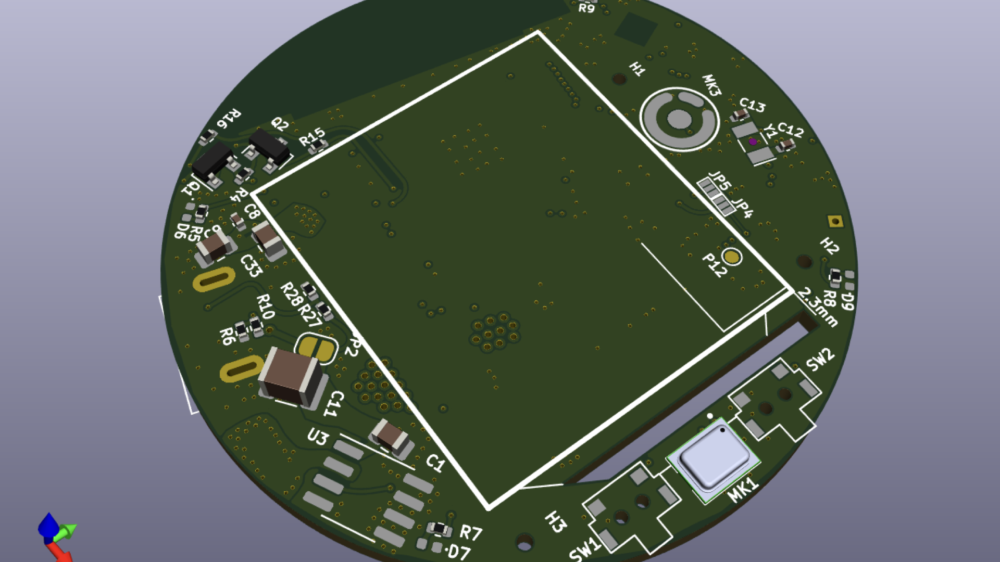
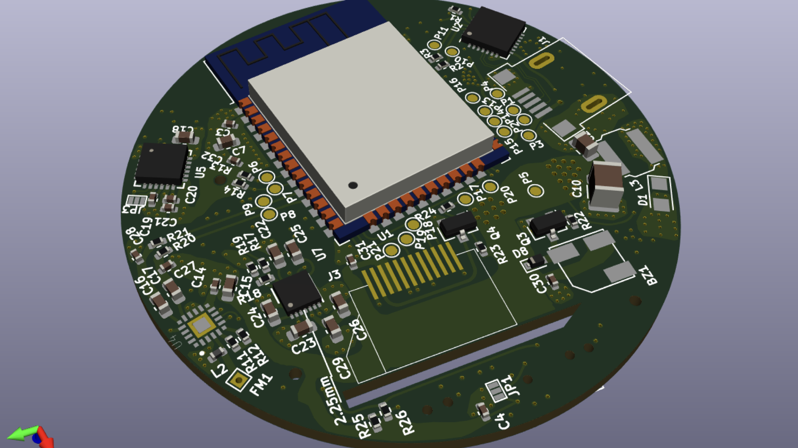

- **Software:** The PCB was designed in KiCad 5.
- **Components:**
  - **ESP32 Module:** Core processing unit.
  - **CP2102N:** For USB connectivity, allowing programming and data reading through the console.
  - **XL1509:** A converter for stepping down from 5V to 3.3V.
  - **SI4713 FM Transmitter with RDS:** We planned to generate an 'Traffic' RDS signal, which could switch nearby car radios to a traffic channel to broadcast information about the approaching emergency vehicle.
  - **MPU-6050:** For activating energy-saving mode when the vehicle is stationary for an extended period.
  - **INMP441 Digital Microphone and a Legacy Electret Microphone with Amplifier:** To test if the PCB, without the mess of wires, would collect fewer interferences.
  - **SPI 1.3 inch LCD Display (240x240 pixels) with ST7789s Controller.**
- **Shape and Assembly:** The PCB was designed in a round form to accommodate two versions of the device. It was ordered from JLCPCB, with parts from LCSC and manually assembled using a hand-operated pick and place machine.

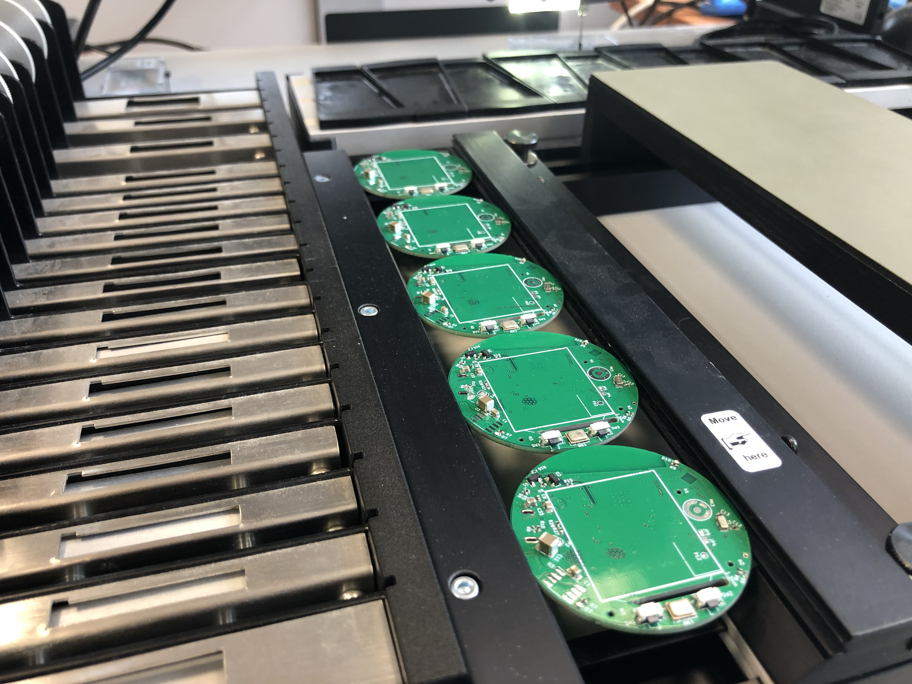

https://github.com/lukasznowarkiewicz/Emersense/assets/82212257/2ed6d327-44b5-4cf7-a69e-9ff8332732e1

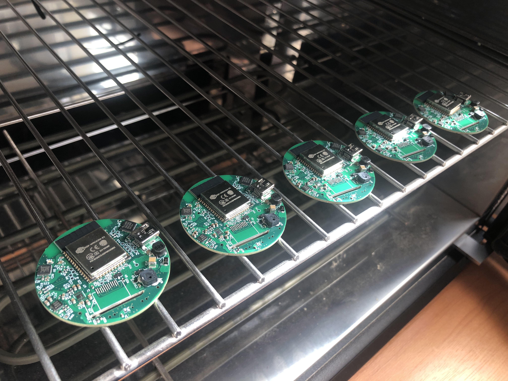

### Enclosure Design

- **Software:** Designed in Fusion 360.
- **Versions:** Two variants were created - one to be mounted on the windshield and another to be inserted into the cigarette lighter socket.
- **Manufacturing:** The enclosures were printed on an Anycubic Photon S SLA printer and cured under a UV nail lamp for hardening.

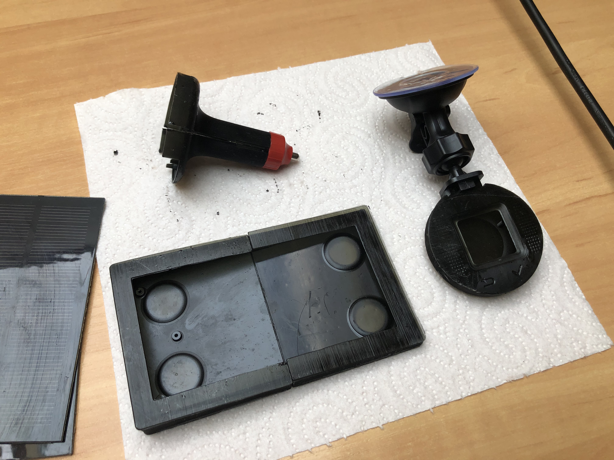
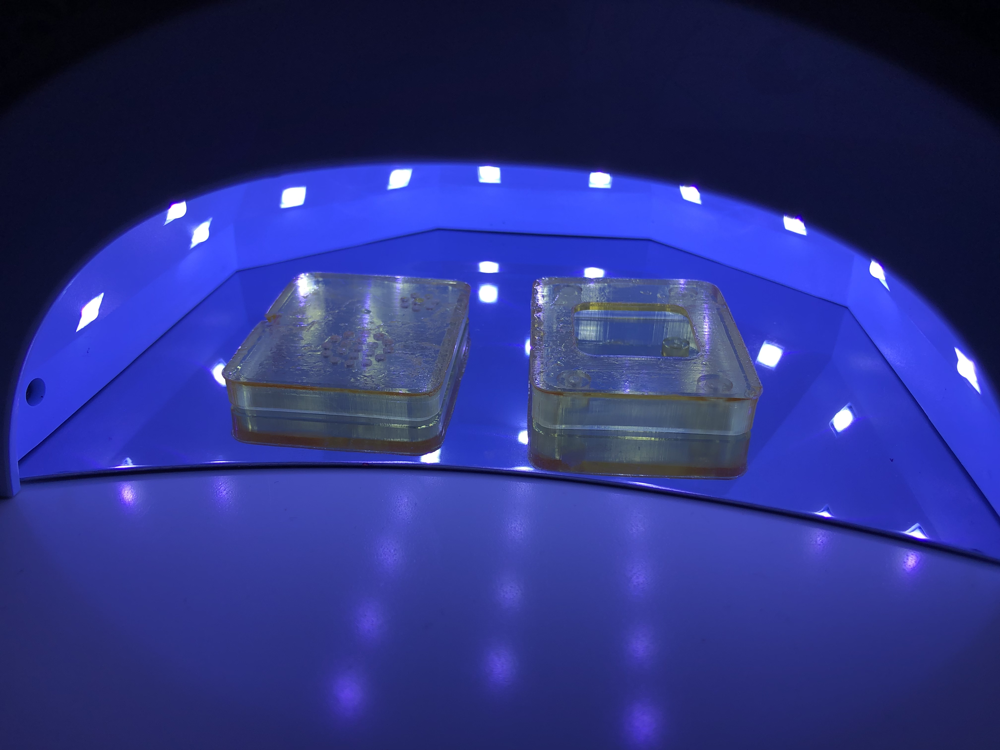
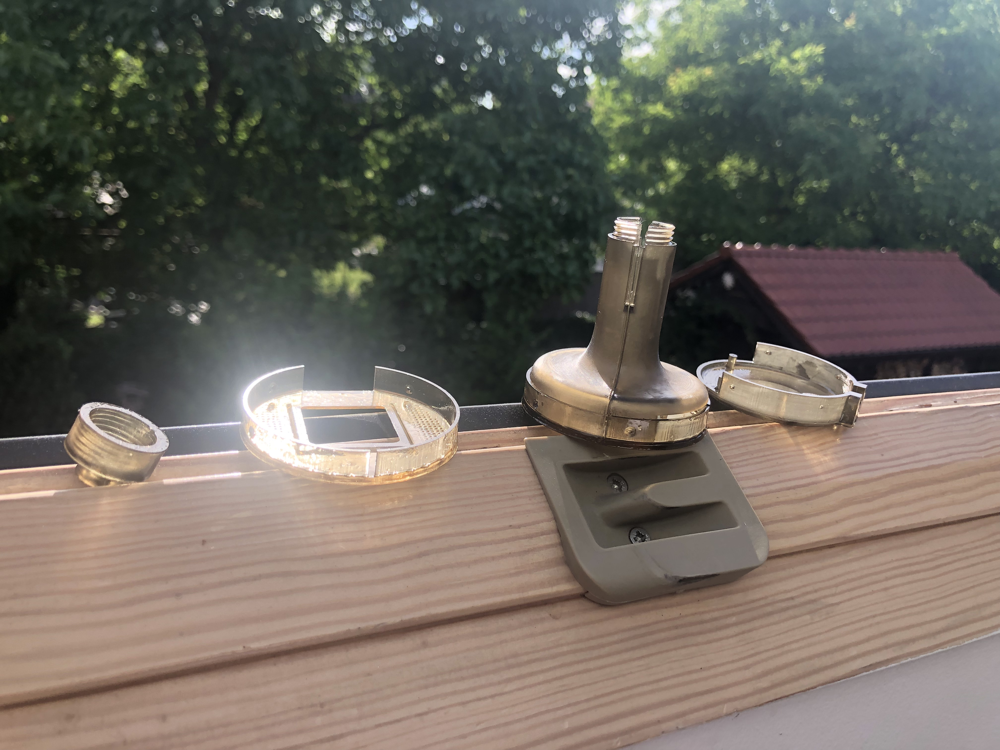

This stage marked a significant advancement towards finalizing the product, focusing on both functionality and aesthetics.

## Testing and Further Work

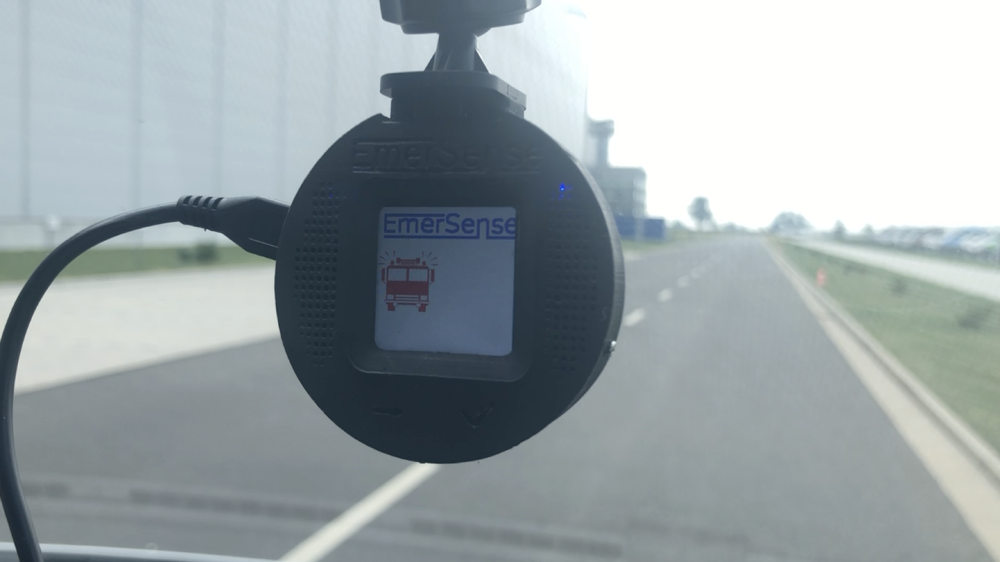
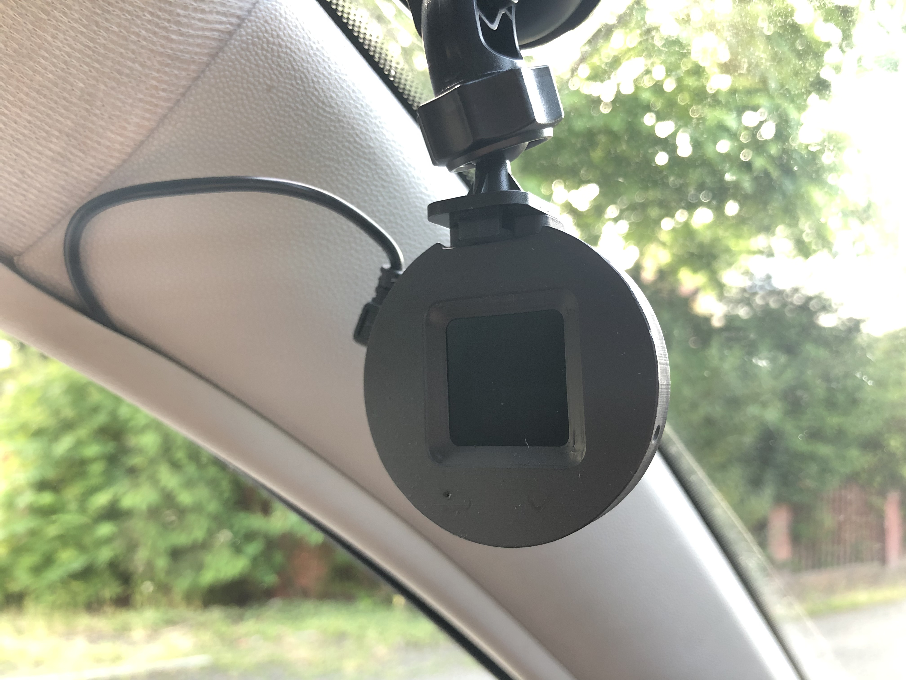

This phase was particularly challenging. We were focused on improving the software, but progress was slow. Even with relatively simple sirens, it was difficult to balance the system's sensitivity to quickly detect sirens without being triggered by random noises. More accurate methods, like the autocorrelation function between the spectrum of a reference signal and the captured signal, were computationally complex, and we couldn't implement them to work in real-time.

At the same time, the competition, which emphasized presenting the project rather than its operational success, demanded a significant amount of time for preparing presentations and other materials. This took away valuable time that could have been spent on development. Moreover, a complete misunderstanding of the problem we were working on and what it takes to work on such projects by the leadership of the student organization didn't make things easier.

https://github.com/lukasznowarkiewicz/Emersense/assets/82212257/d63571b1-7acb-4b1e-807d-cb3acde2b61a

Considering all these challenges, after presenting our project at the competition, we decided to close the project. Interestingly, after we had stopped working on it, the rector of the Poznan University of Technology showed interest in the device, having heard about it in local TV news. He wanted to assemble a team of doctors and PhD students to assist in the project. However, by that time, we had already concluded the project, seeing no further prospects for it. This experience was a valuable lesson on how institutions like universities can sometimes fall short in supporting such projects.

## Summary - Conclusions

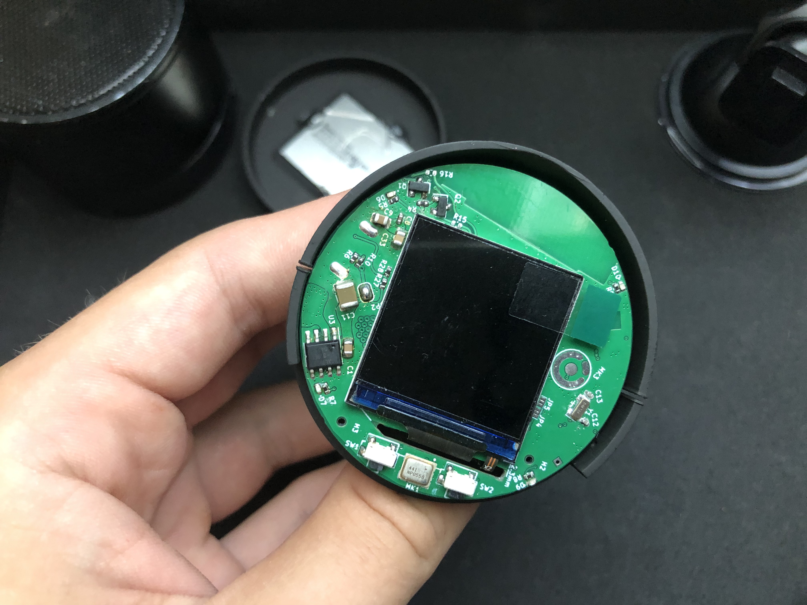
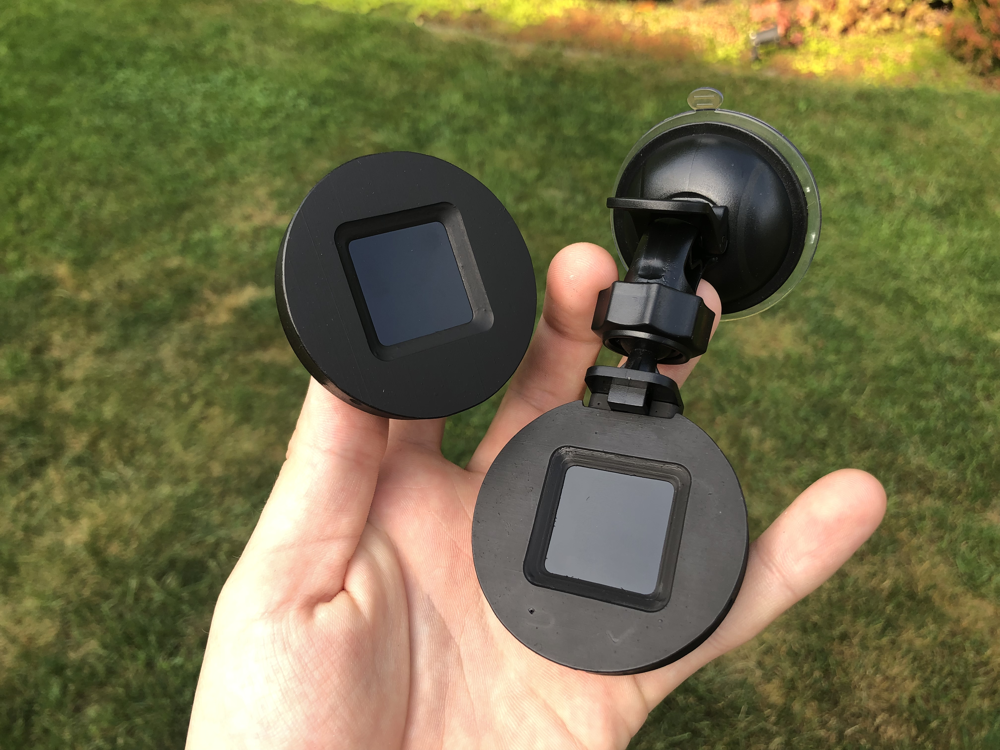
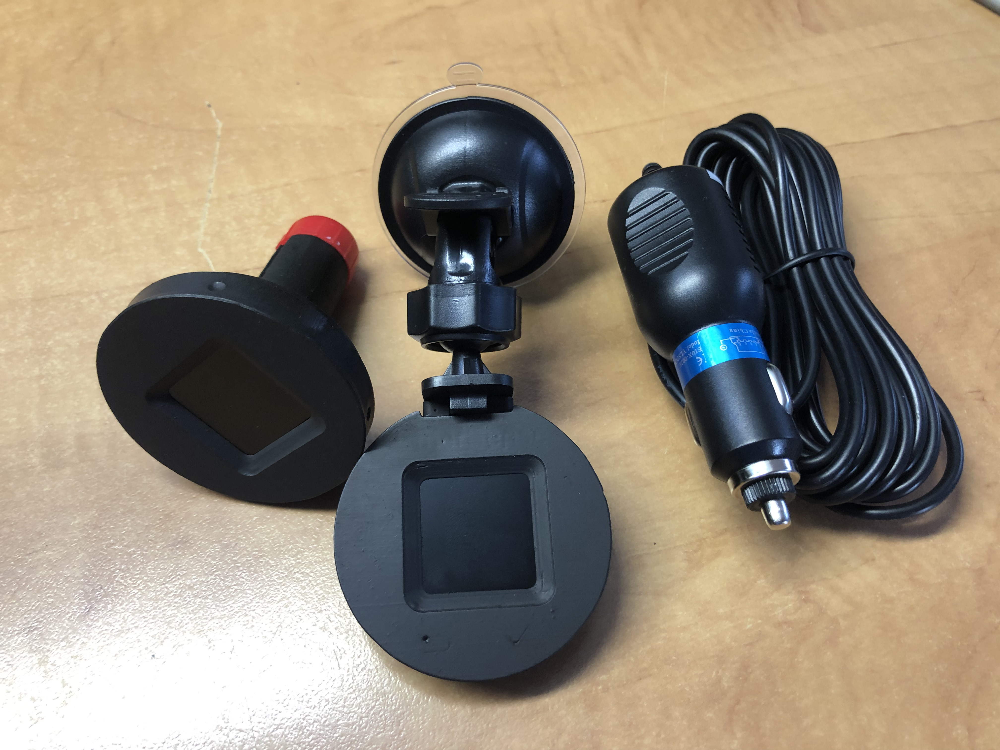

Reflecting on the Emersense project, we came away with several crucial insights. A major gap in our approach was the lack of a clear business model, an oversight that might have been mitigated by considering the device as part of a larger integrated system. The complexity of distinguishing emergency vehicle sirens—a problem we initially underestimated—proved to be a significant challenge. Our discussions with industry professionals, including a director from a leading automotive computer company, highlighted the universal struggle with this issue. Their interest in collaboration pointed to its relevance, yet the continued absence of such technology in cars indicates a widespread challenge.

Market demand for the device remained uncertain, raising questions about its commercial viability. Although integrating the technology with a charger offered a potential pathway, the standalone module concept failed to meet expectations. This was a lesson in both the technological hurdles and the importance of clear value propositions in product design.

A critical shortcoming in our development process was the organization of software work, particularly the lack of emphasis on automated testing. Effective development practices should have prioritized automated tests for every software version, introducing additional complexities such as hardware simulation and the input of audio in the I2S format. This approach would not only have streamlined troubleshooting but also ensured more rigorous validation of our system's performance.

The project's discontinuation, while disheartening, provided invaluable lessons on navigating the intricate balance between technical innovation and commercial strategy in the automotive technology space.

